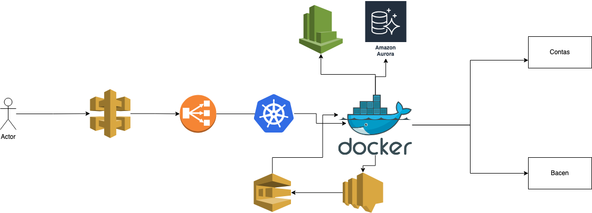

# Arquitetura de Solução

## Escalonamento para Oscilação de Carga:

- Utilizar um cluster Kubernetes para escalabilidade automática dos contêineres.
- Configurar métricas de monitoramento de recursos como CPU e memória para escalar horizontalmente os pods de acordo com a demanda.
- Implementar HPA (Horizontal Pod Autoscaler) para ajustar dinamicamente o número de réplicas dos pods com base na carga de trabalho.

## Proposta de Observabilidade:

- Utilizar o AWS CloudWatch para monitorar os recursos, logs e métricas da aplicação.
- Implementar tracing com AWS X-Ray para rastrear as chamadas de serviço e identificar gargalos de desempenho.
- Usar ferramentas de análise de logs como Elasticsearch, Logstash e Kibana (ELK Stack) para análise detalhada dos logs da aplicação.

## Escolha da Solução de Banco de Dados:

- Utilizar o Amazon RDS (Relational Database Service) com banco de dados relacional como PostgreSQL ou MySQL para armazenar dados transacionais como informações de conta e transações.
- Para operações de baixa latência e alta disponibilidade, pode-se considerar o Amazon DynamoDB para armazenar dados de cache ou dados altamente acessados.

## Tempo Total da Requisição até a Resposta ao Cliente:

- O uso de tecnologias de contêineres e escalabilidade automática ajudará a manter os tempos de resposta baixos.
- O uso de caches e banco de dados otimizados ajudará a reduzir o tempo de resposta das consultas de dados.

## Suporte a Alto Throughput:

- Utilizar um balanceador de carga como o Amazon ELB (Elastic Load Balancer) para distribuir o tráfego entre os pods da aplicação.
- Configurar o Amazon Aurora como banco de dados relacional para garantir que possa lidar com um grande volume de transações por segundo.

## Estratégia para Falha de Dependências:

- Implementar circuit breaker e fallbacks para lidar com falhas de dependências.
- Utilizar retries com backoff exponencial para tentativas de recuperação em caso de falhas temporárias.

## Estratégia para Throttling do BACEN:

- Implementar uma fila de mensagens para armazenar as notificações ao BACEN.
- Configurar um mecanismo de reenvio de notificações com uma política de tentativas e intervalos definidos para garantir que todas as notificações sejam entregues, mesmo em caso de throttling.

### Exemplo de como inserir uma imagem:

